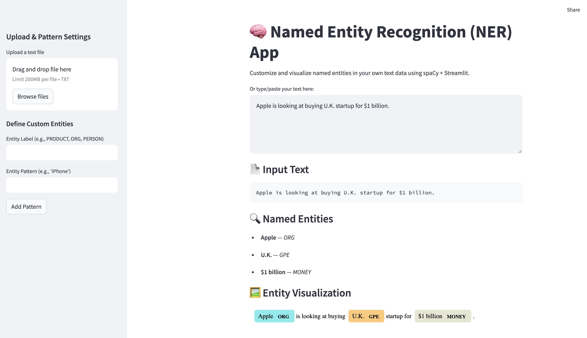
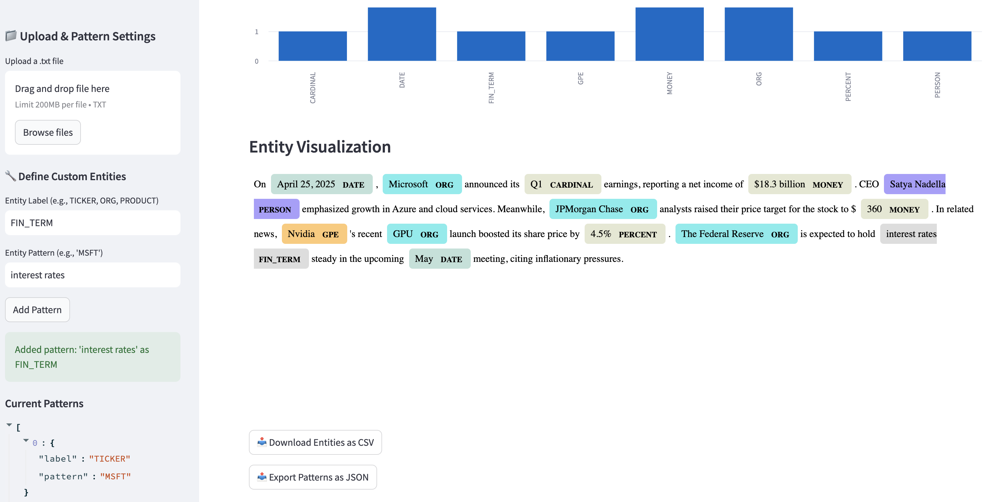
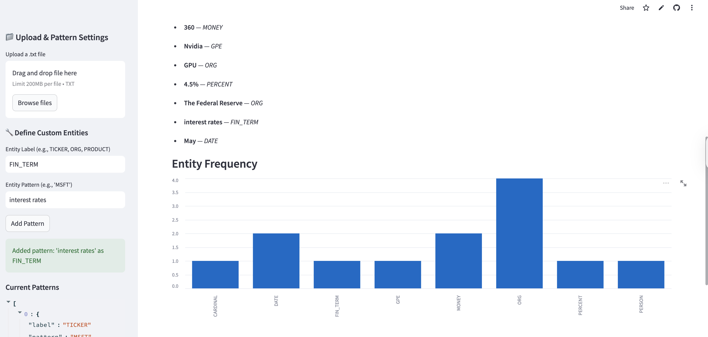

# Named Entity Recognition (NER) Streamlit App

This interactive web app lets users explore and customize **Named Entity Recognition (NER)** using [spaCy](https://spacy.io/) and [Streamlit](https://streamlit.io/). Built for experimentation and education, it supports rule-based entity recognition through spaCy's `EntityRuler` and interactive visualizations.

Access the live app here: 🔗 (https://hood-python-portfolio-chfnvfg4lpz5zora763kvf.streamlit.app/)

---

## Project Overview

**NER** is a Natural Language Processing (NLP) task that automatically identifies and classifies named entities—such as people, organizations, locations, or dates, in text.  
This app enhances NER by allowing users to:

- Upload their own text or enter it manually
- Add **custom entities and rules** (e.g., "PRODUCT: MFST, interest rates")
- Visualize results using spaCy’s DisplaCy
- Export data for further analysis

This NER application is ideal for finance, journalism, academic research, or anyone curious regarding NER workflows.

--- 
## Setup Instructions

### Clone the Repository

```bash
git clone https://github.com/yourusername/ner-streamlit-app.git
cd ner-streamlit-app
```

### Install Requirements

Make sure you have Python 3.7+ and run:

```bash
pip install -r requirements.txt
```

### Run the App

```bash
streamlit run app.py
```

The app will open in your browser at `http://localhost:8501`

---

## App Features

- **Text Input**: Upload `.txt` files or type/paste text directly
- **Add Custom Entity Rules**: Define entity `label` and `pattern` using spaCy-compatible syntax
- **Entity Filtering**: Select which entity types to display (e.g., only `ORG`, `DATE`)
- **Frequency Chart**: View entity distribution with an interactive bar chart
- **Entity Visualization**: See highlighted entities using spaCy’s DisplaCy
- **Export Options**:  
   - Download extracted entities as CSV  
   - Export your custom rules as a JSON pattern file

### Example Pattern

```json
{"label": "TICKER", "pattern": "MFST"}
{"label": "FIN_TERM", "pattern": "interest rates"}
```

---

## Visual Examples

  
*Main interface with text input and settings sidebar*

  
*DisplaCy rendering of recognized entities*

  
*Interactive bar chart showing entity frequency*

---


## References & Resources

- [spaCy Documentation](https://spacy.io/usage)
- [spaCy EntityRuler](https://spacy.io/api/entityruler)
- [Streamlit Documentation](https://docs.streamlit.io/)
- [DisplaCy Visualizer](https://spacy.io/usage/visualizers#displacy-ent)

---

## Requirements

```bash
streamlit
spacy
pandas
```

Also install the spaCy English model:

```bash
python -m spacy download en_core_web_sm
```
