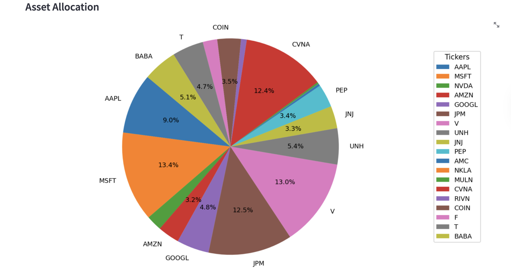
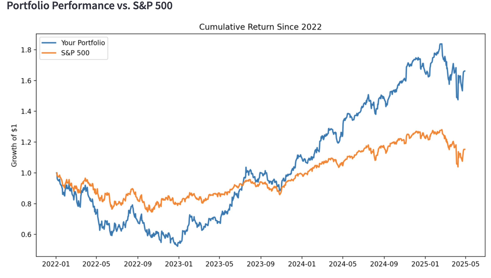
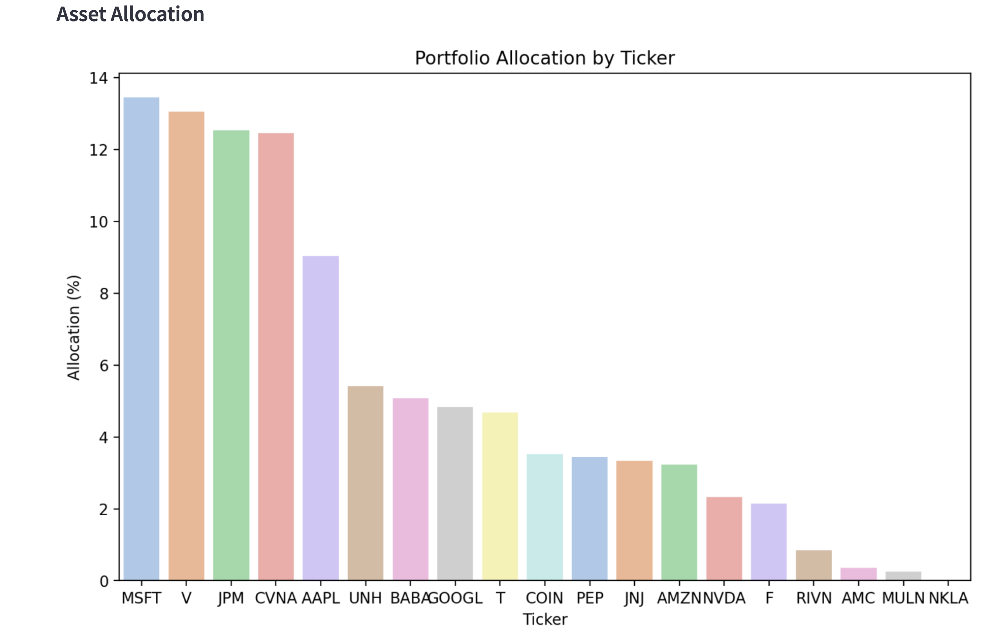
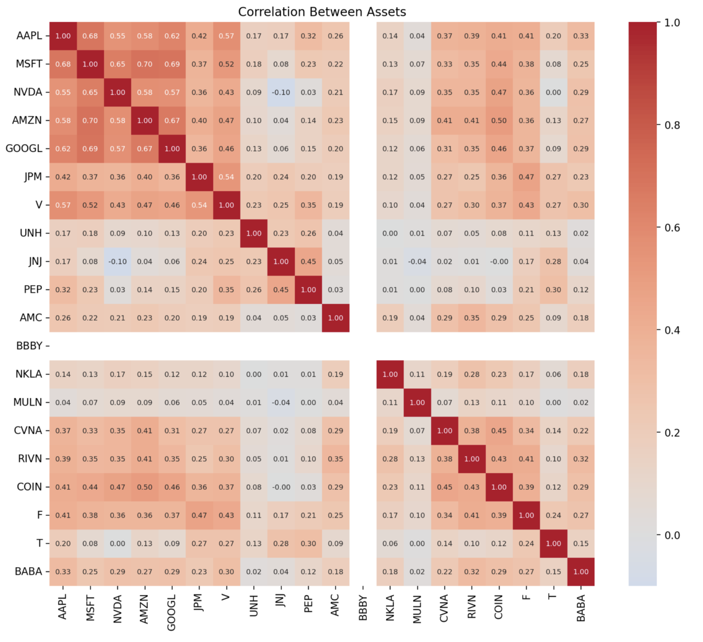
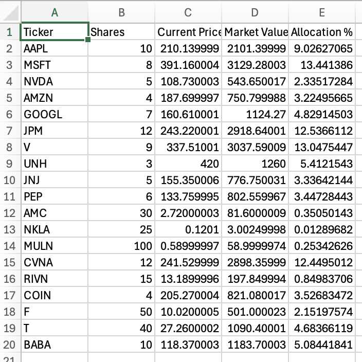

# Investment Portfolio Analyzer

## Project Overview
The Investment Portfolio Analyzer is an interactive Streamlit application that allows users to upload a CSV file of their current stock holdings and receive a detailed analysis of portfolio performance, allocation, and risk.  
The app fetches live stock prices, computes market values, tracks cumulative returns against the S&P 500, calculates portfolio risk metrics such as volatility and Sharpe Ratio, and visualizes data through clean, interactive graphics.

This project was developed as the final project for **Elements of Computing II (Spring 2025)**.

---

## How to Set Up and Run

1. Clone this repository or download the folder locally.
2. Navigate to the `StreamlitAppFinal/` folder.
3. Install the required dependencies:
 ``bash
pip install streamlit pandas numpy yfinance matplotlib seaborn
4. Launch the app locally using the "streamlit run app.py" command 

--- 

## App Features  
1. Upload a CSV containing:
- Ticker (e.g., AAPL)
- Amount of shares owned 
- Purchase price (optional)

2. Calculations: 
- Current portfolio value 
- Asset allocation 
- Unrealized gains or losses (if applicable)

3. Visualizations: 
- Toggleable Pie Chart or Bar Chart of asset allocation
- Cumulative return vs. S&P 500 since 2022
- Correlation heatmap amongst holdings

4. Export Options 
Download your portfolio summary as a clean .csv file directly from the app.

Available Recommended Files:
- Downloadable .csv summary of portfolio holdings
   
     including purchase price: https://nd4-my.sharepoint.com/:x:/g/personal/phood_nd_edu/EVoFtlq33cNIoWQQQInbAWEBsIyOXWq6OOn-zuM4Xxtd1w?e=r9zNeL
  
     without purchase price: https://nd4-my.sharepoint.com/:x:/g/personal/phood_nd_edu/Efvj1CE5HfpMsPZ6Uypm_FYBqJpKsvDCFl8SKsQZwZsV3g?e=r7KA1f 

5. Risk Metrics: 
- Portfolio volatility 
- Sharpe Ratio (3% risk-free rate)
- Beta (vs. S&P 500)
- Maximum drawdown

---

## Disclaimer:
If the 'Purchase Price' is missing for any holdings, unrealized gains and losses will not be calculated.
As a result, the app will still display full market value and allocation data for those assets.

---

## References & Resources
Streamlit Documentation - https://docs.streamlit.io/ 

Yahoo Finance API via yfinance - https://pypi.org/project/yfinance/

Seaborn Documentation - https://seaborn.pydata.org/ 

---

## Visual Examples
Portfolio Overview Example:
 

Allocation Pie Chart Example: 

Cumulative Return vs. S&P 500 Since 2022 Example: 

Allocation Bar Chart Example: 

Portfolio Table Example: 

Portfolio Summary Export Example: 
