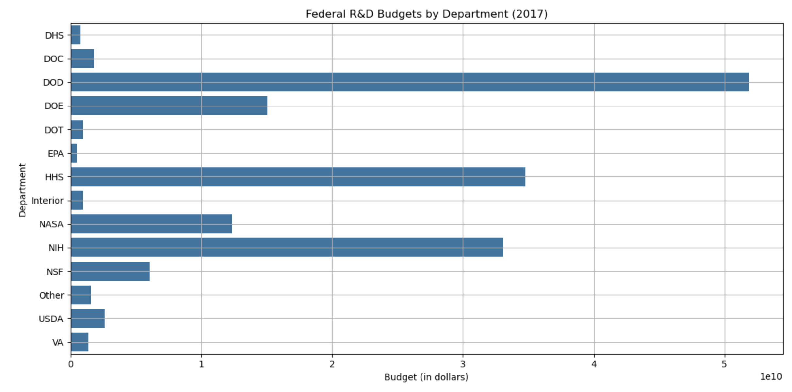

# TidyData-Project
The project aims to clean and reshape a Federal R&D Budgets dataset using tidy data concepts. The intention is to reshape the dataset to a more organized form so it can be more easily analyzed and visualized to see trends in government R&D expenditures over time.

Tidy Data Principles
To make data tidy:
Each variable has its own column.
Each observation is its own row.
Each sort of observational unit is its own table.

Steps in the Notebook
- Load and Inspect Data
- Read in the dataset as a Pandas DataFrame.
- Identify structure and missing value problems.

Data Cleaning & Transformation
- Melt the dataset from wide to long form.
- Extract and clean the Year column from column labels.
- Convert the Budget column to numeric type for analysis.
- Fill in missing values.

Exploratory Data Analysis (EDA)
- Make summary statistics.
- Create a pivot table to observe budget trends over time.

Visualizations
- Line plot of the total federal R&D spending over time.
- Bar plot of the departmental R&D budgets for the most recent year.

Instructions to Run the Notebook

Prerequisites
- Ensure that you have the following Python libraries installed:
- pip install pandas matplotlib seaborn

Running the Notebook
- Open up the Jupyter Notebook environment.
- Execute each cell sequentially to preprocess, analyze, and visualize the data.

Dataset Description
Source: Federal R&D Budgets dataset
Structure: Departments in rows, yearly budgets in columns with GDP values added.
Pre-processing: Reworked broad-format data to a long format for ease of analysis.

References
Pandas Cheat Sheet, https://www.geeksforgeeks.org/pandas-cheat-sheet/
Tidy Data Paper, https://vita.had.co.nz/papers/tidy-data.pdf 

Example Visuals
Examples of the plots are attached. 
[def]: image.png 
